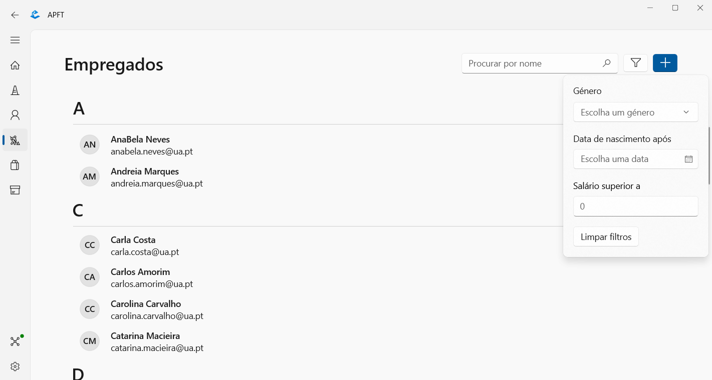
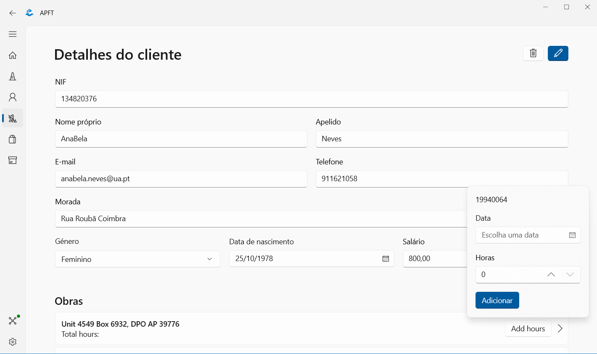
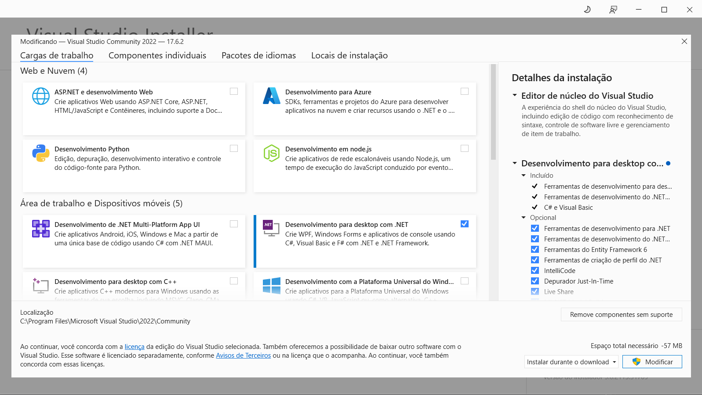
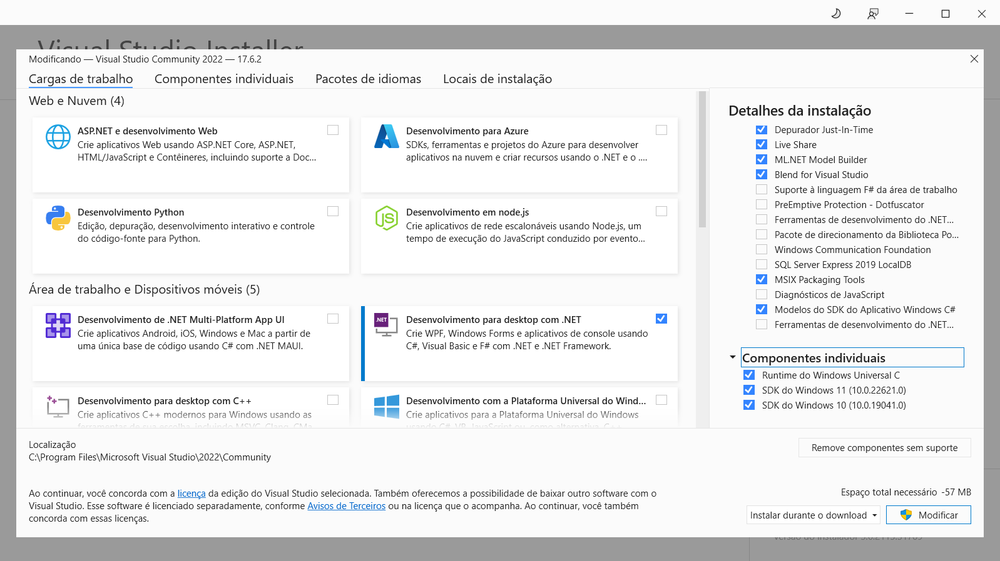

# BD: Trabalho Prático APF-T

**Grupo**: P5G3
- José Gameiro, MEC: 108840
- Rúben Garrido, MEC: 107927

## Introdução / Introduction
 
Para o projeto final da cadeira Base de Dados, o nosso grupo decidiu criar uma base de dados relativa à gestão de uma empresa de construção civil. Esta foca-se, sobretudo, nos empregados, nas obras e no seu material respetivo. Para além disso, existe uma gestão de encomendas aos fornecedores, caso não existam materiais suficientes num armazém.

## ​Análise de Requisitos / Requirements

Relativamente à análise de requisitos o nosso grupo identificou os seguintes:

- Um empregado possui NIF, nome (composto por nome próprio e apelido), e-mail, número de telefone, morada, género, data de nascimento e salário. A este encontra-se igualmente associado um departamento, que possui um ID e um nome. Um CEO é um empregado da empresa. <br />

- Numa obra, caracterizada por ID, localização, data de início e data de fim, e onde trabalham um ou mais empregados (e cujo número de horas efetuadas num dia é guardado), são executados serviços, com ID, nome e categoria. Esta obra está associada a um cliente, que possui NIF, nome (composto por nome próprio e apelido), e-mail, número de telefone e morada. <br />

- Para cada obra, podem ser utilizados materiais de construção, que possuem atibutos como ID, nome, categoria e número de unidades em armazém. Estes materiais podem estar associados a uma ou mais encomendas (com um custo associado por material), caracterizadas por ID e data. <br />

- Cada encomenda está relacionada a uma obra e a um fornecedor, composto por NIF, nome, e-mail, número de telefone e morada.


## DER - Diagrama Entidade Relacionamento/Entity Relationship Diagram

### Versão final/Final version


### APFE 

O nosso grupo decidiu fazer duas alterações ao DER, relativamente à primeira entrega, que foi a troca do atributo data da entidade obra por dois novos atributos, a data de iníco e a data de fim. A outra alteração foi a mudança da relação, entre as entidades de encomenda e obra, que estava de N para M e alterámos para 1 para N.

## ER - Esquema Relacional/Relational Schema

### Versão final/Final Version


### APFE

Para o ER as alterações que o nosso grupo fez também foram semelhantes às do DER, que foi a substituição do atributo data da entidade obra por dois novos atributos, a data de início e a data de fim. A outra alteração foi a eliminação da entidade REL_OBRA_ENCOMENDA, pois esta resultava de uma relação de N para M quee nós eliminámos no DER.

## ​SQL DDL - Data Definition Language

[SQL DDL File](/SQL_scripts/project_ddl.sql "SQLFileQuestion")

### Diagrama gerado a partir do DDL


Para testar as udf's ou store procedure's que nós criámos, desenvolvemos um script em SQL que tem como objetivo inserir dados nas diferentes tabelas que nós criámos.<br />

[Insertions File](/SQL_scripts/project_inserts.sql "InsertFile")

## SQL DML - Data Manipulation Language

### Formulario exemplo/Example Form

A imagem em baixo apresenta a página da interface gráfica, que permite visualizar a lista de empregados que pertencem à empresa de construção, ou seja, que se encontram na base de dados. Para além disso, é possível filtrar os empregados por nome e apelido, género, data de nascimento e salário. Por fim, é possível adicionar um empregado novo.

<br />



<br />

### Funções utilizadas nesta página
```sql
-- Filtrar os empregados por nome e apelido
GO
CREATE FUNCTION getEmpregadoByName(@emp_name VARCHAR(40)) RETURNS TABLE
AS
    RETURN (
        SELECT *
        FROM EMPRESA_CONSTRUCAO.EMPREGADO
        WHERE (@emp_name IS NULL OR (nome_proprio + ' ' + apelido) LIKE @emp_name + '%')
    );
GO

-- Filtrar os empregados por género/data de nascimento/salário
GO
CREATE FUNCTION getEmpregadoBySexBirthSalary(
    @sex CHAR, 
    @birth_date DATE,
    @salary DECIMAL(10,2)) 
RETURNS TABLE
AS
    RETURN (
        SELECT * FROM EMPRESA_CONSTRUCAO.EMPREGADO
        WHERE (@sex IS NULL OR genero = @sex) AND
        (@birth_date IS NULL OR data_nascimento >= @birth_date) AND
        (@salary IS NULL OR salario >= @salary)
    )
GO

-- Adicionar um empregado novo
GO
CREATE PROCEDURE add_employee(
    @nif INT, 
    @first_name VARCHAR(25), 
    @last_name VARCHAR(25), 
    @email VARCHAR(50), 
    @phone_number INT,
    @address VARCHAR(200), 
    @gender CHAR,
    @birth_date DATE, 
    @salary DECIMAL(10,2), 
    @id_dep INT)
AS
BEGIN
    BEGIN TRY
        BEGIN TRANSACTION
            INSERT INTO EMPRESA_CONSTRUCAO.EMPREGADO(nif, nome_proprio, apelido, email, telefone, morada, genero, data_nascimento, salario,id_departamento)
                VALUES (@nif, @first_name, @last_name, @email, @phone_number, @address, @gender, @birth_date, @salary, @id_dep)
            PRINT 'Sucess on the insertion in the table EMPRESA_CONSTRUCAO.EMPREGADO'
        COMMIT
    END TRY
    BEGIN CATCH
        PRINT ERROR_MESSAGE()
        ROLLBACK
    END CATCH
END
GO
```

<br />

Nesta imagem é possível visualizar os detalhes de um empregado. O nosso grupo implementou as funcionalidades de alterar os dados de um empregado e eliminar o empregado. Também é possível visualizar as obras em que este trabalhou bem como o número de horas que este fez, para além disso também é possível adicionar a uma obra mais horas que o empregado tenha feito

<br />



<br />

### Funções utilizadas nesta página
```sql
-- Alterar os dados de um empregado
GO
CREATE PROCEDURE update_employee(
        @nif_empr INT,
        @first_name_empr VARCHAR(25),
        @last_name_empr VARCHAR(25),
        @email_empr VARCHAR(50),
        @phone_number_empr INT,
        @address_empr VARCHAR(200),
        @gender_empr CHAR,
        @birth_date_empr DATE,
        @salary_empr DECIMAL(10,2)
)
AS
BEGIN
    BEGIN TRY
        BEGIN TRANSACTION
            DECLARE @nif_empr_old AS INT;
            DECLARE @first_name_old AS VARCHAR(25);
            DECLARE @last_name_old AS VARCHAR(25);
            DECLARE @email_empr_old AS VARCHAR(50);
            DECLARE @phone_numer_old AS INT;
            DECLARE @address_empr_old AS VARCHAR(200);
            DECLARE @gender_empr_old AS CHAR;
            DECLARE @birth_date_old AS DATE;
            DECLARE @salary_old AS DECIMAL(10,2);

            SELECT @nif_empr_old = E.nif,
                   @first_name_old = E.nome_proprio,
                   @last_name_old = E.apelido,
                   @email_empr_old = E.email,
                   @phone_numer_old = E.telefone,
                   @address_empr_old = E.morada,
                   @gender_empr_old = E.genero,
                   @birth_date_old = E.data_nascimento,
                   @salary_old = E.salario
            FROM EMPRESA_CONSTRUCAO.EMPREGADO AS E
            WHERE nif = @nif_empr OR nome_proprio = @first_name_empr OR apelido = @last_name_empr OR email = @email_empr OR telefone = @phone_number_empr OR morada = @address_empr OR data_nascimento = @birth_date_empr

            PRINT @gender_empr_old
            PRINT @gender_empr

            IF @nif_empr_old != @nif_empr
                BEGIN
                    UPDATE EMPRESA_CONSTRUCAO.EMPREGADO SET nif = @nif_empr WHERE nif = @nif_empr_old;
                    PRINT 'Updated empregado nif with success'
                END

            IF @first_name_old != @first_name_empr
                BEGIN
                    UPDATE EMPRESA_CONSTRUCAO.EMPREGADO SET nome_proprio = @first_name_empr WHERE nif = @nif_empr_old
                    PRINT 'Updated empregado first name with success'
                END

            IF @last_name_old != @last_name_empr
                BEGIN
                    UPDATE EMPRESA_CONSTRUCAO.EMPREGADO SET apelido = @last_name_empr WHERE nif = @nif_empr_old
                    PRINT 'Updated empregado last name with success'
                END

            IF @email_empr_old != @email_empr
                BEGIN
                    UPDATE EMPRESA_CONSTRUCAO.EMPREGADO SET email = @email_empr WHERE nif = @nif_empr_old
                    PRINT 'Updated empregado email with success'
                END

            IF @phone_numer_old != @phone_number_empr
                BEGIN
                    UPDATE EMPRESA_CONSTRUCAO.EMPREGADO SET telefone = @phone_number_empr WHERE nif = @nif_empr_old
                    PRINT 'Updated empregado phone number with success'
                END

            IF @address_empr_old != @address_empr
                BEGIN
                    UPDATE EMPRESA_CONSTRUCAO.EMPREGADO SET morada = ISNULL(@address_empr, morada) WHERE nif = @nif_empr_old
                    PRINT 'Updated empregado address with success'
                END

            IF @gender_empr_old != @gender_empr OR (@address_empr_old IS NULL)
                BEGIN
                    UPDATE EMPRESA_CONSTRUCAO.EMPREGADO SET genero = ISNULL(@gender_empr, genero) WHERE nif = @nif_empr_old
                    PRINT 'Updated empregado gender with success'
                END

            IF @birth_date_old != @birth_date_empr
                BEGIN
                    UPDATE EMPRESA_CONSTRUCAO.EMPREGADO SET data_nascimento = ISNULL(@birth_date_empr, data_nascimento) WHERE nif = @nif_empr_old
                    PRINT 'Updated empregado birth date with success'
                END

            IF @salary_old != @salary_empr
                BEGIN
                    UPDATE EMPRESA_CONSTRUCAO.EMPREGADO SET salario = ISNULL(@salary_empr,salario) WHERE nif = @nif_empr_old
                    PRINT 'Updated empregado salary with success'
                END
        COMMIT
    END TRY

    BEGIN CATCH
        PRINT ERROR_MESSAGE()
        ROLLBACK
    END CATCH
END
GO

-- Eliminar um empregado
GO
CREATE PROCEDURE delete_employee(@employee_nif INT)
AS
BEGIN
    BEGIN TRY
        BEGIN TRANSACTION
            DELETE FROM EMPRESA_CONSTRUCAO.EMPREGADO WHERE nif = @employee_nif
            PRINT 'Deleted empregado with success'
        COMMIT
    END TRY

    BEGIN CATCH
        PRINT ERROR_MESSAGE()
        ROLLBACK
    END CATCH
END
GO

-- Filtrar as obras e empregados por nif do empregado
GO
CREATE FUNCTION getObraEmpregadoByEmpregado(@empr_nif INT) RETURNS TABLE
AS
    RETURN (
        SELECT REL_O_E.nif_empregado, REL_O_E.id_obra, O.localizacao, O.data_inicio, O.data_fim
        FROM EMPRESA_CONSTRUCAO.REL_OBRA_EMPREGADO AS REL_O_E
        JOIN EMPRESA_CONSTRUCAO.OBRA AS O ON REL_O_E.id_obra = O.id
        WHERE nif_empregado = @empr_nif
    );
GO

-- Adicionar um número de horas de um empregado a uma obra
GO
CREATE PROCEDURE add_empregado_obra(@id_obra INT, @nif_empr INT, @work_day DATE, @work_hours TIME)
AS
BEGIN
    BEGIN TRY
        BEGIN TRANSACTION
            INSERT INTO EMPRESA_CONSTRUCAO.REL_OBRA_EMPREGADO(id_obra, nif_empregado, dia, horas)
                VALUES (@id_obra, @nif_empr, @work_day, @work_hours)
        COMMIT
    END TRY

    BEGIN CATCH
        PRINT ERROR_MESSAGE()
        ROLLBACK
    END CATCH
END
GO
```

## Normalização/Normalization

A nossa base de dados encontra-se normalizada até à 3ª forma normal. <br />

Para chegarmos a esta forma normal, começámos por, primeiro, verificar se esta se encontrava na 1ª forma normal, para isso tínhamos que garantir que não existiam atributos multivalor e que não existiam relações dentro de outras relações ou seja, *Nested Relations*. Efetuámos estes testes e não encontrámos nenhum dos pontos referidos acima por isso concluímos que a nossa base de dados se encontrava na 1ª forma normal. <br />

De seguida fomos averiguar se esta se encontrava na segunda forma normal, ou seja, todos os atributos não pertencentes a qualquer chave candidata devem depender totalmente da chave primária e não da parte dela (não existência de depências parciais). Verificámos se a nossa base de dados cumpria com estes requisitos, concluímos que esta estava e que se encontrava assim na 2ª forma normal. <br />

Por fim, analisámos se a nossa base de dados se encontrava na 3ª forma normal, ou seja, se não existiam  dependência funcionais entre atributos não chave (não existência de dependências transitivas). Confirmámos que não existiam dependências transitivas e concluímos assim que a nossa base de dados se encontrava também na 3ª forma normal. <br />

Durante este processo, tivemos o cuidado de irmos rever todas as entidades e suas relações. Além disso, procuramos eliminar redundâncias e inconsistências para obter uma base de dados otimizada e eficiente.

## Índices/Indexes

Os índices que foram criados na tabela EMPREGADO e CLIENTE da base de dados EMPRESA_CONSTRUCAO têm como objetivo otimizar a velocidade e eficiência das consultas realizadas nesses campos.<br />

No caso do índice idxEmpName, ele foi criado na tabela EMPREGADO para os campos nome_proprio e apelido. Isso significa que a base de dados irá criar uma estrutura de índice específica para esses campos, permitindo uma busca mais rápida e eficiente por registros que correspondam aos valores informados nesses atributos.<br />

Da mesma forma, o índice idxClientName foi criado na tabela CLIENTE para os campos nome_proprio e apelido. Essa indexação tem como objetivo acelerar as consultas que envolvem a busca por registros de clientes com base nos seus nomes próprios e apelidos. 

<br />

```sql
CREATE INDEX idxEmpName ON EMPRESA_CONSTRUCAO.EMPREGADO(nome_proprio,apelido);
GO

CREATE INDEX idxClientName ON EMPRESA_CONSTRUCAO.CLIENTE(nome_proprio,apelido);
GO
```

## SQL Programming: Stored Procedures, Triggers, UDF

[SQL SPs File](/SQL_scripts/project_sps.sql "SQLFileQuestion")

[SQL UDFs File](/SQL_scripts/project_udfs.sql "SQLFileQuestion")

[SQL Triggers File](/SQL_scripts/project_triggers.sql "SQLFileQuestion")

[SQL Indexes File](/SQL_scripts/project_indexes.sql)

<br />

Utilizámos transações em algumas operações, maioritariamente em store procedure's, visto que estas são operações que envolvem várias instruções ou em alguns casos as queries/instruções envolvem adicionar/alterar/eliminar dados de várias tabelas. <br />

## Outras notas/Other notes

O nosso grupo decidiu desenvolver a interface gráfica para a base de dados com WinAppSDK + WinUI 3 pois estas tecnologias fornecem um conjunto de ferramentas e bibliotecas que facilitam o desenvolvimento de uma aplicação Windows moderna e escalável com uma interface para o utilizador mais bonita e responsiva.

WinAppSDK é um conjunto de ferramentas e bibliotecas fornecidas pela Microsoft para ajudar os desenvolvedores a criar aplicações para o Windows. Este inclui recursos como modelos de projeto, APIs, entre outros.

WinUI 3 é uma estrutura de interface para o utilizador que é construída em cima do WinAppSDK. Eeste fornece um conjunto de controles e estilos moderno.

Ao usar WinUI 3 e WinAppSDK para criar a interface gráfica, aproveitámos os seguintes benefícios:

- O WinUI 3 fornece um conjunto de controles pré-construídos e estilos tal como referido anteriormente; <br />

- WinAppSDK fornece uma variedade de APIs e bibliotecas que podem ser usadas para interagir com o sistema operativo Windows e outros componentes do sistema, como por exemplo, a existência de um modo escuro/claro.

Para o nosso grupo poder utilizar estas bibliotecas/ferramentas tivemos que selecionar as seguintes opções no Visual Studio Installer:





## Execução/Execution
Para executar os ficheiros sql pela ordem certa:
1. Executar o ficheiro project_drops.sql, caso a base de dados exista no servidor, caso contrário avançar para o próximo ponto;
2. Executar o ficheiro project_ddl.sql para criar o schema e as respetivas tabelas;
3. Executar o ficheiro project_inserts.sql para inserir dados nas tabelas criadas;
4. Executar o ficheiro project_udfs.sql para criar as udf's e testá-las;
5. Executar o ficheiro project_sps.sql para criar os store procedure's e testá-los;
6. Executar o ficheiro project_triggers.sql para criar os triggers e testá-los;
7. Executar o ficheiro project_indexes.sql para criar os índices;

Com estes ficheiros executados a base dados encontra-se completa, logo pode-se executar a parte da interface gráfica no visual studio, no entanto esta só poderá ser executada caso todas as packages referidas acima tenham sido, caso contrário o visual studio irá pedir para instalar as packages em falta.

## Conclusão

Em conclusão, o nosso grupo considerou importante e interessante o desenvolvimento deste projeto final, pois ajudou-nos a melhor perceber como um sistema de bases de dados funciona. Consideramos que trabalhámos os 2 de forma igual e por isso consideramos que cada um teve 50% emm relação à percentagem de contribuições para o projeto final.
