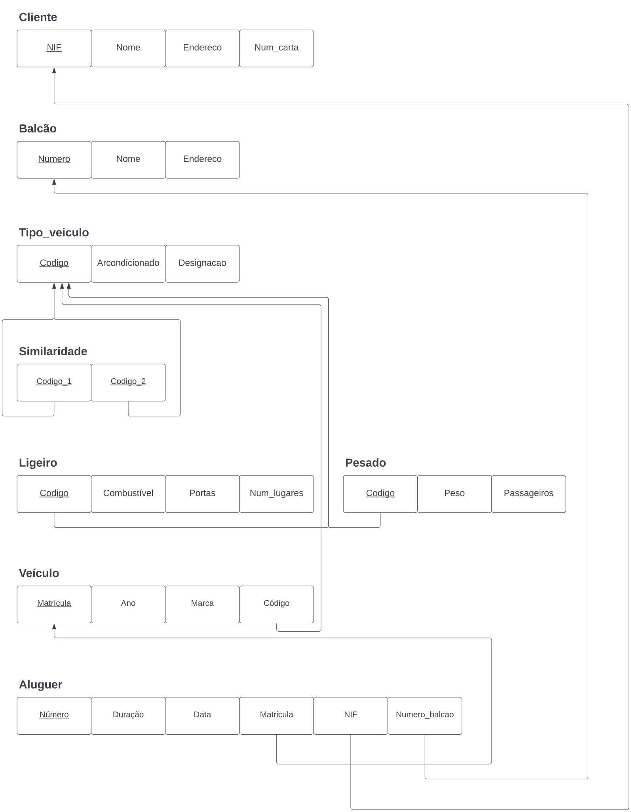
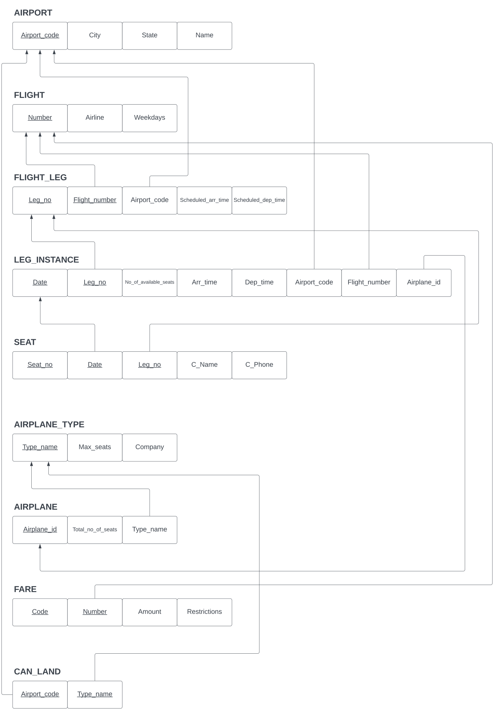
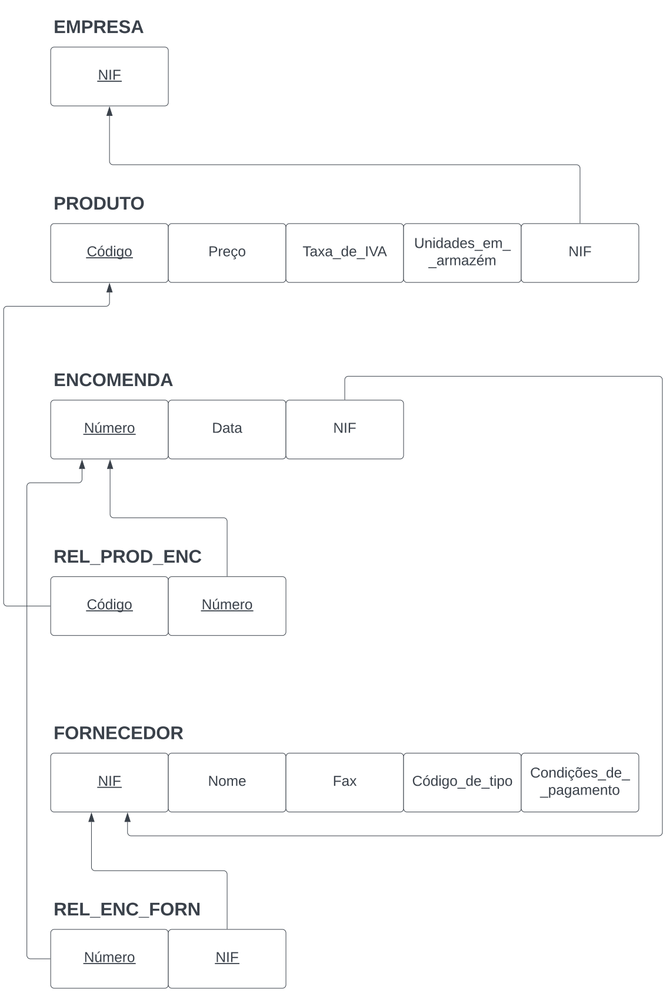
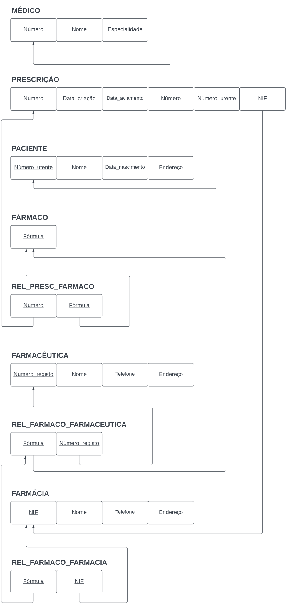
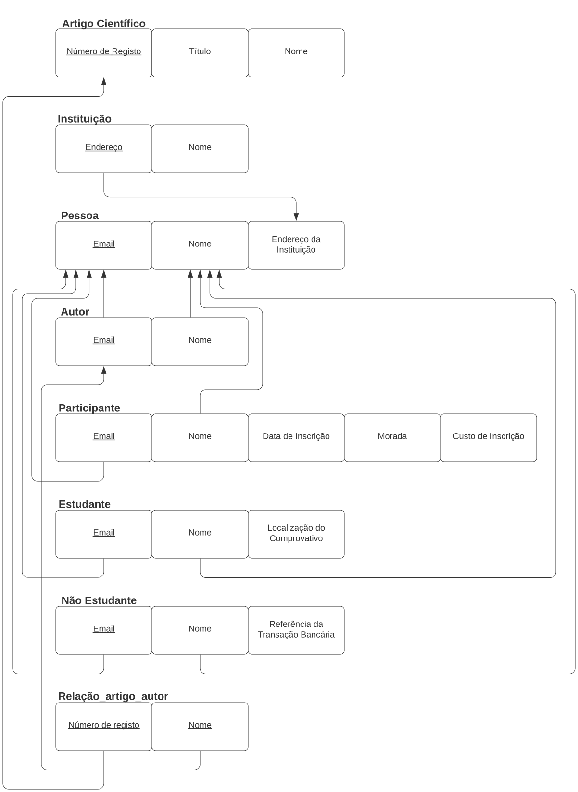
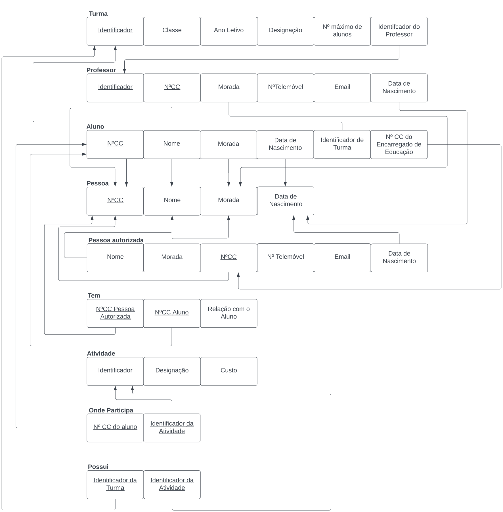

# BD: Guião 3


## ​Problema 3.1
 
### *a)*

```
Cliente(NIF, nome, endereço, num_carta)
Aluguer(número, duracao, data)
Balcao(número, nome, endereço)
Veiculo(matrícula, ano, marca)
Tipo_veiculo(codigo, arcondicionado, designacao)
Similaridade()
Ligeiro(codigo, combustivel, portas, numlugares)
Pesado(código, peso, passageiros)
```


### *b)* 

```
Cliente:
- Chaves candidatas: NIF, num_carta
- Chave primária: NIF
- Chaves estrangeiras: ---

Aluguer:
- Chaves candidatas: número
- Chave primária: número
- Chave estrangeira: NIF(Cliente), matrícula(Veiculo), numero(Balcão)

Balcão:
- Chaves candidatas: numero
- Chave primária: numero
- Chaves estrangeiras: ---

Veículo:
- Chaves candidatas: matricula
- Chave primária: matricula
- Chave estrangeira: codigo(tipo_veiculo)

Tipo_veiculo:
- Chaves candidatas: codigo
- Chave primária: codigo
- Chaves estrangeiras: ---

Similaridade:
- Chaves candidatas: codigo_1, codigo_2
- Chaves pirmárias: codigo_1, codigo_2
- Chaves estrangeiras: codigo_1, codigo_2

Ligeiro:
- Chaves candidatas: codigo
- Chave primária: codigo
- Chaves estrangeiras: codigo

Pesado:
- Chaves candidatas: codigo
- Chave primária: codigo
- Chaves estrangeiras: codigo
```


### *c)* 




## ​Problema 3.2

### *a)*

```
Relações:
Airport(Airport_code, City, State, Name)

Flight_leg(Leg_no, flight_number, Airport_code, scheduled_arr_time, scheduled_dep_time)

Leg_instance(Date, No_of_available_seats, arr_time, dep_time, airport_code, Leg_no, Flight_number, airplane_id)

Seat(Seat_no, Leg_no, Date, customer_name, costumer_phone)

Airplane_type(Type_name, Max_seats, Company)

Airplane(Airplane_id, Total_no_of_seats, type_name)

Flight(Number, Airline, Weekdays)

Fare(Code, Amount, Restrictions, flight_number)

Can_land(Airport_code, Type_name)
```


### *b)* 

```
Airport:
- Chaves candidatas: Airport_code
- Chave primária: Airport_code
- Chaves estrangeiras:

Flight_leg:
- Chaves candidatas: Leg_no, flight_number
- Chaves primárias: Leg_no, flight_number
- Chaves estrangeiras: Airport_code, flight_number

Leg_instance:
- Chaves candidatas: Leg_no, Date
- Chaves primárias: Leg_no, Date
- Chaves estrangeiras: Leg_no, Airport_code, Airplane_id

Seat:
- Chaves candidatas: Seat_no, Leg_no, Date
- Chaves primárias: Seat_no, Leg_no, Date
- Chaves estrangeiras: Leg_no, Date

Airplane Type:
- Chaves candidatas: Type_name
- Chave primária: Type_name
- Chaves estrangeiras: ---

Airplane:
- Chaves candidatas: Airplane_id
- Chave primária: Airplane_id
- Chaves estrangeiras: Type_name

Fare:
- Chaves candidatas: flight_number, code
- Chaves primárias: flight_number, code
- Chaves estrangeiras: flight_number

Can_land:
- Chaves candidatas: Airport_code, Type_name
- Chaves primárias: Airport_code, Type_name
- Chaves estrangeiras: Airport_code, Type_name
```


### *c)* 




## ​Problema 3.3


### *a)* 2.1



### *b)* 2.2



### *c)* 2.3



### *d)* 2.4

