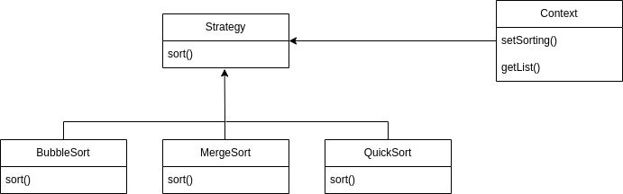

# Aula11

## Exercício 1

### a):

Neste problema pode ser aplicado o padrão Strategy uma vez que este possibilita 
a implementação de qualquer algoritmo já previamente definido. Aqui, cada algoritmo 
de ordenação seria uma Classe concreta que extende da interface do algoritmo, neste 
caso com o método sort();

### b):

